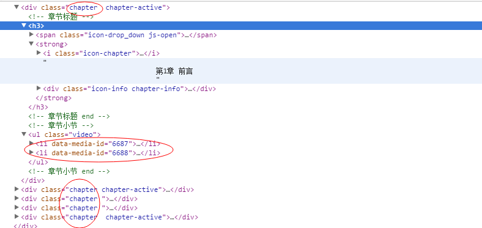

# 爬虫

## 目录

* [抓取目标数据](#抓取目标数据)

  * [采用http模块](#采用http模块)

  * [chromeless中间件](#chromeless中间件)

* [使用cheerio解析](#使用cheerio解析)

* [案例](#案例-爬取某网站课程标题信息)

## 抓取目标数据

#### 采用http模块

> 在 nodejs中 https.get() 或者 http.get() 获取的数据是在js运行之前的数据

```javascript
  //根据抓取目标网站不同来确定是http 还是 https
  const http = require('http');
  const https = require('https');
  const url = 'https://www.baidu.com';
  https.get(url, res => {
      let html = "";

      //加载数据
      res.on("data", data => {
          html += data;
      })

      //打印数据
      res.on("end", () => {
          console.log(result);
      })
  }).on('error', e => {
      console.log('或数数据出错！', e);
  })
```

#### chromeless中间件

> 浏览器中审查元素查看到的信息是js运行之后的结果，如果使用http模块对于js运行之后的数据是抓取不到的，针对这个问题可以使用chromeless中间件模拟chrome浏览器运行来得到js运行之后的数据。关于chromeless模块可参考官方文档来学习 [https://github.com/graphcool/chromeless](https://github.com/graphcool/chromeless)

安装chromeless模块 ``` npm install chromeless --save ```

```javascript
  const { Chromeless } = require('chromeless')
  const cl = new Chromeless();
  const html = cl
      .goto(url)
      .html()

  //每次抓取到数据之后如果需要关闭浏览器，在.html()之后加上一个.end()即可

  //打印数据
  html.then( data => {
      console.log(data);
  }).catch( err => {
      console.log(err);
  })
```

## 使用cheerio解析

> cheerio 是一个运行于后台,操作dom节点的插件，可以认为是一个nodejs版的jquery

安装cheerio ``` npm install cheerio --save ```

首先你需要加载html

```javascript
//假设html为以下结构
let html = `
<!doctype html>
<html>
    <body>
        <!-- header -->
        <div class="header-bg">
            <header class="container">
                <ul class="nav-ul">
                    <li><a href="http://www.qzfweb.com/">首页</a></li>
                    <li><a href="http://www.qzfweb.com/cate/1">前端开发</a></li>
                    <li><a href="http://www.qzfweb.com/cate/2">后端开发</a></li>
                    <li><a href="http://www.qzfweb.com/cate/20">环境搭建</a></li>
                </ul>
            </header>
        </div>
    </body>
</html>
`;

const cheerio = require('cheerio');
let $ = cheerio.load(html);

```

之后你可以通过css selector 来筛选元素

```javascript

let lis = $('.header-bg .container .nav-ul li'); //拿到每一个li

```

如果html文档中有多个li 此时你拿到的将是每一个对象，需要使用each来遍历

```javascript

let data = [];

lis.each(function(item){
    let element = $(this);
    let text = element.find('a').text();

    data.push(text);
});

//打印爬取的数据
console.log(data); // [ '首页', '前端开发', '后端开发', '环境搭建' ]
```

## 案例-爬取某网站课程标题信息

分析dom节点，可以看到源代码中，我们要抓取的数据都是包含在一个个标签里面，要分析其DOM结构，遵循其中的规律



下面给出实例，可以将以下实例拷出本地直接运行。

```javascript
  var http = require('http'); //加载http模块
  var cheerio = require('cheerio'); //加载cheerio模块，在服务器端解析代码
  var url = 'http://www.imooc.com/learn/348';
  function filterChapter(html){
      var $ = cheerio.load(html);
      var chapters = $('.chapter'); //拿到每一章
      var courseData = [];
      chapters.each(function(item){ //对每一章进行遍历
          var chapter = $(this); //获取每一张对象
          var chapterTitle = chapter.find('strong').text();  //章节标题
          var videos = chapter.find('.video').children('li');

          var chapterData = {  //存储每一张的信息
              chapterTitle:chapterTitle,
              videos:[]
          }
          videos.each(function(item){
              var video = $(this).find('.J-media-item'); //先获取这个a标签
              var videoTitle = video.text();   //视频标题
              var id = video.attr('href').split('video/')[1]; //id
              chapterData.videos.push({
                  title:videoTitle,
                  id:id
              });
          }); //遍历这个标题数组
          courseData.push(chapterData); //将每一章的信息 push进去
      });
      return courseData;
  }
  function printCourseInfo(courseData){
      courseData.forEach(function(item){
          var chapterTitle = item.chapterTitle;
          console.log(chapterTitle + '\n');
          item.videos.forEach(function(video){
              console.log('  【'+video.id+'】  '+ video.title + '\n');
          });
      });
  }
  http.get(url,function(res){
      var html = "";
      //下面这个data事件不断的被触发，这个html数据片段就会不断的累加
      res.on('data',function(data){
          html += data;
      });
      res.on('end',function(){ //在end事件里面，我们会把数据给打印出来
          var courseData = filterChapter(html);  //将html的内容过滤
          printCourseInfo(courseData);
      });
  }).on('error',function(){ //注册一个
      console.log('获取课程数据出错！');
  });
```
